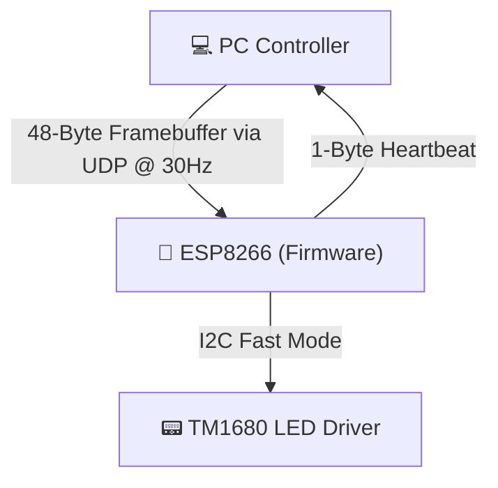

# PunkCyber Clock — Thin Client UDP LED Display Driver Firmware

[](https://www.arduino.cc/)
[](https://www.espressif.com/en/products/socs/esp8266)
[](https://en.wikipedia.org/wiki/C%2B%2B17)
[](https://arduino.github.io/arduino-cli/)

This folder contains the custom C++ firmware for the **DIY Cyberpunk Desktop Ornament WFD Electronic Clock** (commonly found on AliExpress, such as [this model](https://www.aliexpress.com/item/1005010368155991.html)). 

It replaces the stock offline firmware with a high-performance **"Thin Client"** UDP receiver. Rather than handling heavy layout rendering or external API calls locally, the ESP8266 acts as a fast display pipe—listening for raw 48-byte framebuffers over UDP and writing them directly to the TM1680 LED driver over I2C.

---

## 📊 System Data Flow



---

## 🏛️ Firmware Architecture & Components

The codebase is structured into modular components:

| File | Purpose | Technical Features |
|---|---|---|
| [`cyberpunk_clock.ino`](file:///c:/Users/anton/Desktop/esp8266/cyberpunk_clock/cyberpunk_clock.ino) | Main sketch | Coordinates connections, manages status LEDs, calls I2C displays, and implements OOM allocation guards. |
| [`tm1680.h`](file:///c:/Users/anton/Desktop/esp8266/cyberpunk_clock/tm1680.h) / [`.cpp`](file:///c:/Users/anton/Desktop/esp8266/cyberpunk_clock/tm1680.cpp) | TM1680 LED Driver | Dual-protocol driver supporting 2-Wire (I2C fast mode @ 400kHz) and 3-Wire bit-bang interfaces. Features scoped enums and type-safe `constexpr` registers. |
| [`udp_display.h`](file:///c:/Users/anton/Desktop/esp8266/cyberpunk_clock/udp_display.h) / [`.cpp`](file:///c:/Users/anton/Desktop/esp8266/cyberpunk_clock/udp_display.cpp) | UDP Display Pipe | Listens for 48-byte UDP payloads. Supports signature-guarded (`0xC0` prefix) progressive config packets up to 127 bytes without size clamps or collision. |
| [`webportal.h`](file:///c:/Users/anton/Desktop/esp8266/cyberpunk_clock/webportal.h) / [`.cpp`](file:///c:/Users/anton/Desktop/esp8266/cyberpunk_clock/webportal.cpp) | AP Config Portal | Captain portal running in Access Point mode to configure credentials. |
| [`config.h`](file:///c:/Users/anton/Desktop/esp8266/cyberpunk_clock/config.h) / [`.cpp`](file:///c:/Users/anton/Desktop/esp8266/cyberpunk_clock/config.cpp) | Persistent Flash Config | Bypasses standard EEPROM. Writes configurations relative to the logical configured flash size (`ESP.getFlashChipSize()`) to avoid SDK parameter sectors. |
| [`buttons.h`](file:///c:/Users/anton/Desktop/esp8266/cyberpunk_clock/buttons.h) / [`.cpp`](file:///c:/Users/anton/Desktop/esp8266/cyberpunk_clock/buttons.cpp) | Button Debouncer | Custom debouncing state machine. Supports a configurable 3-second hold logic on Button C for factory resets. |

---

## 🛠️ Hardware Specification & Pinout

* **Microcontroller:** ESP8266 (Generic, configured for a 512KB flash partition)
* **Display Driver:** TM1680 (configured for 16 Common lines × 48 Segment lines)
* **Wiring Pinout:**
  * **I2C SDA:** GPIO 4 (D2)
  * **I2C SCL:** GPIO 5 (D1)
  * **Button C:** GPIO 14 (D5) — Wiped/reset config trigger (Hold for 3 seconds to reboot into AP mode)
  * **Button A / B:** GPIO 13 (D7) / GPIO 12 (D6) — Exposed, reserved for local custom logic

---

## 💾 Core Logic & Optimizations

### 1. Memory Optimization (Lazy Initialization)
To work around the limited heap space of the ESP8266, the `WebPortal` object (which instantiates the `ESP8266WebServer` and `DNSServer`) is lazy-allocated using a pointer (`WebPortal* portal = nullptr;`). In normal STA mode (successful WiFi connection), the portal is never loaded into RAM, saving **~1.5KB of static RAM** and significant runtime heap overhead.

### 2. Display Caching (Dirty Checking)
All writes to the display go through a centralized `updateDisplay(buffer)` helper. The function caches the active display buffer in a static array and compares new writes using `memcmp`. Physical transactions over I2C only occur when the framebuffer is updated, drastically reducing I2C bus traffic and electrical noise.

### 3. Progressive UDP Configuration
Remote configuration commands can be sent via UDP packets starting with the byte `0xC0`:
* `[0xC0, 0x01, ...SSID]` — Set WiFi SSID
* `[0xC0, 0x02, ...PASSWORD]` — Set WiFi Password
* `[0xC0, 0x03, ...PC_IP]` — Set target host PC IP
* `[0xC0, 0x04, port_low, port_high]` — Set host PC Port (2-byte little endian)
* `[0xC0, 0xFF]` — Commit changes to flash and restart.

These variables accumulate inside a persisted `ClockConfig _pendingCfg` member in RAM and are written to flash all at once on the `0xFF` save command, preventing premature flash degradation.

---

## 📟 TM1680 Framebuffer Memory Map

The incoming 48-byte UDP packet writes directly to the 48 registers of the TM1680. The memory maps to the display elements as follows:

### 1. 7-Segment Clock Digits (6 Positions)
Driven by even byte addresses: `0x0C` (Leftmost), `0x0E`, `0x10`, `0x12`, `0x14`, `0x16` (Rightmost).
* **Segment Bits**:
  * `Bit 0` = segment `e`
  * `Bit 1` = segment `f`
  * `Bit 2` = segment `g`
  * `Bit 3` = *Shared Icon/Colon* (see below)
  * `Bit 4` = segment `a`
  * `Bit 5` = segment `b`
  * `Bit 6` = segment `c`
  * `Bit 7` = segment `d`

* **Colons & Overlaid Icons**:
  * **HH:MM Colon:** Byte `0x0E`, `Bit 3`
  * **MM:SS Colon:** Byte `0x12`, `Bit 3`
  * **Audio Indicator Icon:** Byte `0x01`, `Bit 3`
  * **WiFi Indicator Icon:** Byte `0x0A`, `Bit 3` *(Firmware managed status)*
  * **Computer/PC Indicator Icon:** Byte `0x04`, `Bit 3` *(Firmware managed status)*

### 2. Starburst 14-Segment Digits (6 Positions)
Used for scrolling text. Each digit is split across two contiguous bytes:
* **Outer Byte (Even Address):** `0x00` (Leftmost), `0x02`, `0x04`, `0x06`, `0x08`, `0x0A`
  * `Bit 0`=e, `Bit 1`=f, `Bit 2`=g, `Bit 3`=Icon, `Bit 4`=a, `Bit 5`=b, `Bit 6`=c, `Bit 7`=d
* **Inner Byte (Odd Address):** `0x01`, `0x03`, `0x05`, `0x07`, `0x09`, `0x0B`
  * `Bit 0`=l, `Bit 1`=m, `Bit 4`=h, `Bit 5`=i, `Bit 6`=j, `Bit 7`=k
* **Segment Layout Map**:
  ```text
            aaaa
          f\h|i/j b
            g g
          e/k|l\m c
            dddd
  ```

### 3. Day of the Week LED Indicators
* **Monday to Thursday:** Bytes `0x18` (Bits `0x01` to `0x08`)
* **Friday to Sunday:** Bytes `0x19` (Bits `0x01` to `0x04`)
* **Sunday Extra Highlight:** Byte `0x01`, `Bit 2` (Bitmask `0x04`)

### 4. 7x7 LED Dot Matrix Grid
Row-major layout (Row 0 is Top, Col 0 is Left). Index is calculated as `Row * 7 + Col`:
* **Row 0:** Byte `0x0F` (Bits `0x20`, `0x40`, `0x80`, `0x01`, `0x02`, `0x04`, `0x08`)
* **Row 1:** Byte `0x0C` (Col 0: `Bit 0x08`) / Byte `0x0D` (Col 1-6: `0x10`, `0x20`, `0x40`, `0x80`, `0x01`, `0x02`)
* **Row 2:** Byte `0x0D` (Col 0-1: `0x04`, `0x08`) / Byte `0x19` (Col 2-4: `0x02`, `0x04`, `0x08`) / Byte `0x1A` (Col 5-6: `0x10`, `0x20`)
* **Row 3:** Byte `0x1A` (Col 0-6)
* **Row 4:** Byte `0x1B` (Col 0-6)
* **Row 5:** Byte `0x1C` (Col 0-6)
* **Row 6:** Byte `0x1C` (Col 0: `Bit 0x08`) / Byte `0x1D` (Col 1-6)

---

## 🚀 Compilation & Deployment

1. Install [Arduino CLI](https://arduino.github.io/arduino-cli/) or open this folder in the Arduino IDE.
2. Install the **esp8266** board package (v3.1.2 or higher).
3. Connect the ESP8266 via USB/Serial and flash the sketch:
   * **CLI Command**:
     ```bash
     arduino-cli compile --fqbn esp8266:esp8266:generic:eesz=512K,baud=115200,ResetMethod=nodemcu .
     arduino-cli upload -p COM11 --fqbn esp8266:esp8266:generic:eesz=512K,baud=115200,ResetMethod=nodemcu .
     ```
4. Set the Serial Monitor to `115200` to confirm boots and connections.
